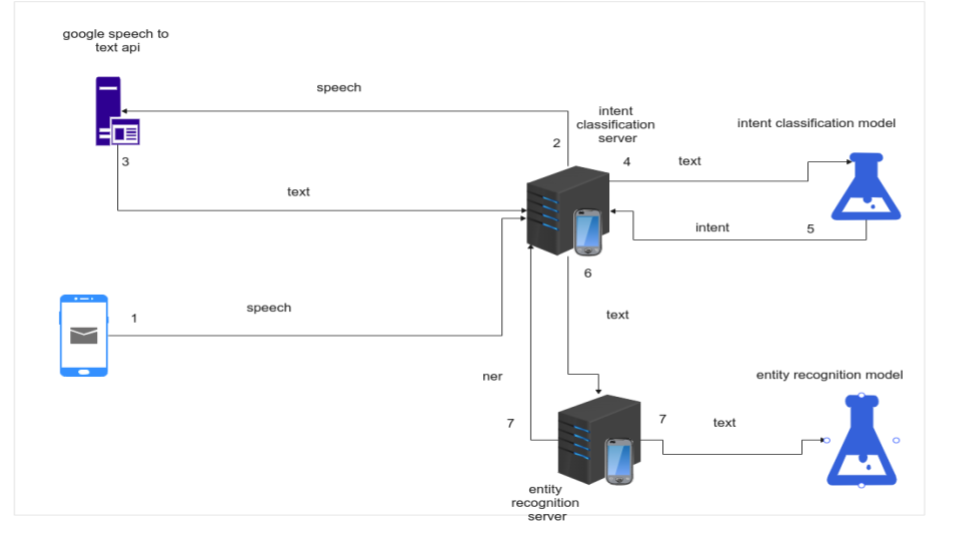

<h1 align="center">
   
  Shams Virtual Assistant
</h1>

 
Shams is an Arabic application that allows you to give voice commands to your phone in an Egyptian accent 

 

Table of Contents

  1. [Introduction](#👋-introduction)
        + [Why](#why)
        + [What is this repository for?](#what-is-this-repository-for)
        + [Features](#features)
  2. [System Architecture](#system-architecture)
  3. [Getting Started](#🚀-getting-started)
        + [Prerequisites](#prerequisites)
        + [Installation](#installation)
  4. [Contributing](#❤️-contributing)
  5. [Contributors](#👨-contributors)

## 👋 Introduction

**Shams** is an **open-source** Arabic personal assistant mobile application.

Shams **do commands** when you **ask him to**.

You can **talk to Shams** in an Egyptian accent and Shams will **respond to you**.

You can also **text Shams** and Shams will also **respond to you**.

### Why?

> According to the statistics we have collected Arabic and its dialects have little ground in the area of research within Natural Language Processing (NLP). compared to English Even though Arabic is one of the most used languages around the globe.  

### What is this repository for?

> This repository contains the stable release of the following:  
> - [Shams Main server](https://github.com/AhmedAbdelGawadFarag/Arabic-Virutal-Assistant-Server)
> - [Named Entity Recognition (NER) server](https://github.com/AhmedAbdelGawadFarag/ArabicNer)
> - [Intent classification training code](https://github.com/AhmedAbdelGawadFarag/arabic-intent-classification)
> - [The android application](https://github.com/AbdelRahmanRefaat/Shams-Virtual-Assistant)

### Features

> 1. Calendar Management 
> 2. Email Management
> 3. Translation
> 4. Contact Management 

### System Architecture

## 🚀 Getting Started

### Prerequisites
> Each server has its own prerequisites

1. ##### [Shams main Server](https://github.com/AhmedAbdelGawadFarag/Arabic-Virutal-Assistant-Server)
   - [Python 3.8](https://www.python.org/downloads/release/python-380/)
   - Python Requirements file

2. ##### [Ner server](https://github.com/AhmedAbdelGawadFarag/ArabicNer)
    - [Python 3.6](https://www.python.org/downloads/release/python-360/)
    - Python Requirements file

3. ##### [intent classification](https://github.com/AhmedAbdelGawadFarag/arabic-intent-classification)
    > Kaggle notebook has all the requirements https://www.kaggle.com/ahmedabdelgawad/arabic-intent-classification  

4. #### [android application](https://github.com/AhmedAbdelGawadFarag/marcello-chat-bot)
    > all the prerequisites in the Gradle file

### Installation
> Read the doc of each repo to get more information about the installation
> 
> #### Docker Installation
>
> - [ ] there will be an official docker image in the future

## ❤️ Contributing

If you have an idea for improving Shams, do not hesitate.

**Shams needs open source to live**, the more data Shams has, the more skillful she becomes.

## 👨 Contributors

<table>
  <tbody>
    <tr>
      <td align="center" valign="middle" width="128">
        <a href="https://github.com/AhmedAbdelGawadFarag">
          
          Ahmed Abdelgawad
        </a> 
      </td>
      <td align="center" valign="middle" width="128">
        <a href="https://github.com/AbdelRahmanRefaat">
          
          AbdelRahman Refaat
        </a> 
      </td>
      <td align="center" valign="middle" width="128">
        <a href="https://github.com/ahmedskh">
          
          Ahmed Saad
        </a> 
      </td>
      <td align="center" valign="middle" width="128">
        <a href="https://github.com/hagerosama">
          
          Hager Osama
        </a> 
      </td>
      <td align="center" valign="middle" width="128">
        <a href="https://github.com/AhmedEssam14">
          
          Ahmed Essam
        </a> 
      </td></tr>
  </tbody>
</table>
